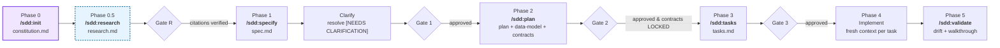

# Spec-Driven Development Skill

[](https://skills.sh)
[](https://github.com/mariano-aguero/spec-driven-development-skill)
[](LICENSE)
[](https://github.com/mariano-aguero/spec-driven-development-skill/releases/latest)
[](https://github.com/mariano-aguero/spec-driven-development-skill/commits/main)
[](https://github.com/mariano-aguero/spec-driven-development-skill/stargazers)

[](https://claude.ai/code)
[](https://cursor.sh)
[](https://github.com/features/copilot)
[](https://www.jetbrains.com/junie/)
[](https://codeium.com/windsurf)

> **Stop vibe-coding. Specify, then implement.**
> An **Agent Skill** that turns informal prompts into structured, traceable, drift-resistant
> specifications — so AI coding agents build what you actually asked for.

Compatible with Claude Code, Cursor, GitHub Copilot, JetBrains Junie, Windsurf, and similar tools.

---

## Why Spec-Driven Development?

Without a spec, AI agents make thousands of micro-decisions silently. Each one is a
potential divergence from intent — and they compound.

| Without SDD | With SDD |
|---|---|
| "Add user auth" → AI picks a stack, invents schema, guesses error behavior | Constitution + spec + contracts define every decision upfront |
| Same prompt, three sessions, three different implementations | Specs are the source of truth — regeneration is deterministic |
| Drift discovered in code review (or production) | Drift detected in Phase 5 against the locked contracts |
| Pivots = manual rewrites | Pivots = systematic re-specification |
| Implicit assumptions baked into acceptance criteria | Assumptions surfaced and corrected *before* the spec is written |
| Specs written against an imagined codebase | Phase 0.5 research maps the real one first, with `file:line` citations |
| Code ships faster than anyone can read it | Comprehension gate: the team reviews ~400 dense lines instead of a 2000-line diff |

## What is Spec-Driven Development?

SDD makes **specifications the source of truth**. The workflow:

0. **Constitution** — project-level immutable constraints (one-time per project)
0.5. **Research** *(conditional)* — how the existing system actually works, cited `file:line`
1. **Specify** — requirements, MoSCoW acceptance criteria, boundaries
2. **Plan** — architecture, data model, locked API contracts
3. **Tasks** — atomic, dependency-mapped, test-first
4. **Implement** — AI runs with fresh context per task, constrained by all artifacts above
5. **Validate** — drift detection + traceability matrix + linear walkthrough


```mermaid
flowchart LR
    P0["Phase 0<br/><b>/sdd:init</b><br/>constitution.md"]:::once --> PR
    PR["Phase 0.5<br/><b>/sdd:research</b><br/>research.md"]:::cond --> GR{Gate R}
    GR -->|citations verified| P1
    P1["Phase 1<br/><b>/sdd:specify</b><br/>spec.md"] --> CL["Clarify<br/>resolve [NEEDS CLARIFICATION]"]
    CL --> G1{Gate 1}
    G1 -->|approved| P2["Phase 2<br/><b>/sdd:plan</b><br/>plan + data-model + contracts"]
    P2 --> G2{Gate 2}
    G2 -->|approved & contracts LOCKED| P3["Phase 3<br/><b>/sdd:tasks</b><br/>tasks.md"]
    P3 --> G3{Gate 3}
    G3 -->|approved| P4["Phase 4<br/>Implement<br/>fresh context per task"]
    P4 --> P5["Phase 5<br/><b>/sdd:validate</b><br/>drift + walkthrough"]

    classDef once fill:#f0e6ff,stroke:#7c3aed,stroke-width:2px
    classDef cond fill:#e6f4ff,stroke:#0369a1,stroke-width:2px,stroke-dasharray: 4 3
```

Every arrow is a **compaction boundary**: each phase reads the previous artifact, never the
raw material behind it. That is what keeps agents inside a productive context window instead
of drowning in their own search results.

## Installation

```bash
npx skills add mariano-aguero/spec-driven-development-skill
```

The skill activates automatically when you reference spec-driven development, spec authoring,
SDD, requirements planning, or AI implementation guidance.

## Workflow at a Glance

```text
/sdd:init                                 # once per project
  → creates constitution.md

/sdd:research "add user authentication"   # skip on greenfield
  → specs/user-auth/research.md           (how the code works today, file:line cited)

/sdd:specify "add user authentication"
  → creates specs/user-auth/spec.md       (MoSCoW ACs + Boundaries + open questions)

/sdd:clarify
  → resolves [NEEDS CLARIFICATION] before Plan

/sdd:plan
  → specs/user-auth/plan.md               (architecture, risks)
  → specs/user-auth/data-model.md         (entities + migrations)
  → specs/user-auth/contracts/auth-api.md (LOCKED after Gate 2 approval)

/sdd:tasks
  → specs/user-auth/tasks.md              (ordered, test-first, [P] for parallel)

# implement each task with fresh AI context; commit after each
# if a task outgrows its context window → progress.md → fresh session

/sdd:validate
  → traceability matrix + drift report
  → linear walkthrough for the humans who will maintain it
```

Other commands: `/sdd:status` (where am I?), `/sdd:analyze` (cross-feature conflict check),
`/sdd:amend` (cascade spec updates).

## What It Costs

Being explicit, since nobody else is:

| | |
|---|---|
| Loaded on every conversation (skill metadata) | ~120 tokens |
| Loaded when the skill activates (`SKILL.md`) | ~3,700 tokens |
| A full feature, all reference files loaded | ~23,000 tokens of skill |

That last figure excludes your code and the artifacts the workflow generates. Industry
reports put spec-driven workflows at roughly 20–40% higher token spend than unstructured
prompting — offset by fewer discarded implementation cycles, not by being cheaper per turn.

Reference files load on demand, so a feature that skips research or stops at Phase 3 costs
proportionally less. If you only want the cheat sheet, `references/quick-reference.md` is
~1,700 tokens on its own.

## What's Included

| File | Contents |
|------|---------|
| `SKILL.md` | Entry point: full workflow, spec levels, context model, comprehension debt, reference index |
| `references/artifact-templates.md` | Templates for `constitution.md`, `research.md`, `spec.md`, `plan.md`, `data-model.md`, `contracts/`, `tasks.md`, `progress.md`, `decision_log.md` |
| `references/prompt-patterns.md` | Prompts for every phase + Codebase Research, Assumptions Surface, Clarify, Critics, Context Handover, Linear Walkthrough, `/sdd:analyze`, `/sdd:amend` |
| `references/workflow-phases.md` | Step-by-step instructions for Phases 0, 0.5, and 1–5 |
| `references/quality-gates.md` | Gate 0, R, 1–5 and C checklists + CI/CD integration (AC coverage, drift detection) |
| `references/output-formats.md` | Formats and line budgets for everything the user reads: gate verdicts, traceability matrix, drift report, status, walkthrough |
| `references/ai-agent-patterns.md` | Context engineering (compaction, budget, progressive disclosure), multi-agent orchestration, critic subagents, capability profiles |
| `references/anti-patterns.md` | 19 common failure modes with wrong/correct examples and fixes |
| `references/quick-reference.md` | One-page cheat sheet |
| `references/INDEX.md` | Topic navigation across all references |
| `evals/` | Five behavioral scenarios for verifying the skill actually changes agent behavior |

## Complete Example

See [`examples/`](examples/) for a full end-to-end demonstration of every SDD artifact:
a magic-link login feature with `constitution.md`, `spec.md`, `plan.md`, `data-model.md`,
locked `contracts/`, and a dependency-mapped `tasks.md`. Use it as a reference or as a
starter you can clone into a new project.

## When to Use SDD

**Use it when:**

- AI generates code that ignores your constraints
- The same prompt produces different implementations across sessions
- Requirements are complex or have multiple stakeholders
- The feature touches auth, database schema, or public APIs
- Your team needs shared technical understanding before writing code

**Skip it for:**

- Bug fixes under 30 minutes
- Refactors with no behavior change
- Throwaway prototypes

## Key Principles

**Specifications are not suggestions.** API contracts define the exact shape. Code that
deviates from the contract is drift — fix the code, not the spec.

**Research before you specify.** A spec written against an imagined codebase drifts by
construction. Map the real one first — every claim cited `file:line` — then write
requirements that fit the system you actually have.

**Front-load the review.** Reviewing ~200 lines of research prevents thousands of wrong
lines of code; reviewing the code itself prevents one wrong line at a time. Human attention
is worth the most at the front of the workflow, not the end.

**Surface assumptions before specifying.** Ask the AI to list its implicit assumptions
about roles, permissions, error behavior, and scope *before* writing the spec. Correcting
a wrong assumption takes seconds; correcting a wrong AC takes a full `/sdd:amend` cycle.

**Reframe vague requirements.** "Make it faster" is not a spec. "LCP < 2.5s on a 4G
connection" is. Every AC must be independently testable — if you cannot write a failing
test for it, it is not concrete enough.

**Fresh context per task.** Each task gets its own AI session. Accumulated context from
prior sessions introduces wrong assumptions.

**Compact on purpose, not on overflow.** Every artifact is a compaction checkpoint. Work in
the 40–60% context band and hand over via `progress.md` before quality degrades — never let
automatic compaction be the thing that decides which details survive.

**Ship only what someone understands.** Green tests prove correctness, not maintainability.
Run a linear walkthrough before merge and delete any structure that traces to no decision
in `plan.md`.

**Write artifacts, show verdicts.** The workflow generates a lot of markdown, and most of it
is for the next phase — not for you. Artifacts go to files; the response gets the decision
you have to make and the evidence for it. Every user-facing output has a line budget, and
confidence is binary: `[CONFIRMED]` or `[VERIFY]`, never a percentage.

**Commit after each task.** Not at the end of Phase 4. After each individual task.
Clean history enables precise rollback when drift is discovered.

**Commit specs with code.** Spec files belong in the same PR as the implementation they
drive. Treat them as first-class source artifacts, not throwaway documents.

**Human gates are non-negotiable.** `spec.md`, `plan.md`, and `tasks.md` each require human
approval before the next phase begins. AI cannot approve its own output.

## AI Tool Compatibility

| Tool | Status | Notes |
|------|--------|-------|
| Claude Code | ✅ Native | Skill loaded via `skills.sh`; Format A prompts (filesystem access) |
| Cursor | ✅ Supported | Reference files loaded via `@` mentions |
| GitHub Copilot Chat | ✅ Supported | Format B prompts (stateless) for web/chat interfaces |
| JetBrains Junie | ✅ Supported | Reference files loaded as context |
| Windsurf | ✅ Supported | Skill activates on SDD keyword triggers |
| Any LLM (ChatGPT, Gemini, etc.) | ✅ Manual | Copy reference files into context; use Format B prompts |

## Changelog

See [CHANGELOG.md](CHANGELOG.md) for a full history of changes per version.

Latest: **v1.4.0** — AP-15, AP-16, Constitution from Existing Codebase, Cross-Feature Conflict Detector.
See the [latest release](https://github.com/mariano-aguero/spec-driven-development-skill/releases/latest) for full notes.

## Contributing

Contributions are welcome. See [CONTRIBUTING.md](.github/CONTRIBUTING.md) for guidelines on
adding anti-patterns, prompts, templates, and workflow improvements.

Please follow our [Code of Conduct](.github/CODE_OF_CONDUCT.md).

## License

[MIT](LICENSE)
